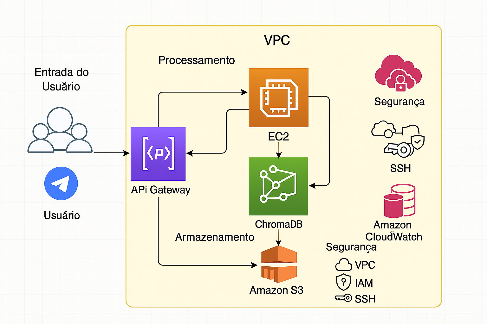

# Chatbot para Consulta de Documentos Jurídicos

## 🎯 Objetivo

Criar um sistema de RAG (Retrieval Augmented Generation) usando AWS Bedrock para consulta de documentos jurídicos através de um chatbot no Telegram, com armazenamento em S3, banco de embeddings Chroma, e logs no CloudWatch.

## 📋 Requisitos

- Python 3.8 ou superior
- Terraform 1.0 ou superior
- AWS CLI configurado
- Conta AWS com acesso aos serviços:
  - S3
  - EC2
  - Bedrock
  - CloudWatch
  - API Gateway
  - IAM

## 🏗️ Arquitetura



O projeto implementa a seguinte arquitetura:
- **S3**: Armazenamento dos documentos jurídicos
- **EC2**: Hospedagem da aplicação
- **Bedrock**: Geração de embeddings e consulta ao modelo de linguagem
- **LangChain**: Framework para processamento de linguagem natural e construção do RAG
- **Chroma**: Banco de vetores para armazenamento de embeddings
- **Telegram**: Interface do chatbot
- **CloudWatch**: Monitoramento e logs da aplicação

## 📁 Estrutura do Projeto

```
.
├── app/                           # Código fonte da aplicação
│   ├── api/                      # API da aplicação
│   │   └── chatbackend.py        # Backend do chatbot com LangChain e RAG
│   ├── bots/                     # Implementação dos bots
│   │   └── botTelegram.py        # Interface do chatbot no Telegram
│   └── services/                 # Serviços da aplicação
│       └── embeddings.py         # Geração e armazenamento de embeddings
├── config/                       # Configurações
│   └── requirements.txt          # Dependências Python
├── dataset/                      # Conjunto de dados
├── infra/                        # Infraestrutura como código
│   └── terraform/                # Configurações Terraform
│       ├── main.tf               # Configuração principal do Terraform
│       ├── variables.tf          # Definição de variáveis
│       ├── outputs.tf            # Definição de outputs
│       ├── versions.tf           # Versões dos providers
│       └── modules/              # Módulos Terraform
│           ├── api_gateway/      # Configuração do API Gateway
│           ├── cloudwatch/       # Configuração do CloudWatch
│           ├── ec2/              # Configuração da instância EC2
│           ├── iam/              # Configuração de IAM
│           ├── s3/               # Configuração do bucket S3
│           └── vpc/              # Configuração da VPC
└── assets/                       # Recursos visuais
    └── sprints_7-8.jpg           # Diagrama de arquitetura
```

## 🔧 Tecnologias Utilizadas

- **AWS**:
  - S3 para armazenamento de documentos
  - EC2 para hospedagem da aplicação
  - Bedrock para embeddings e LLM
  - CloudWatch para logs
  - API Gateway para exposição da API
  - IAM para gerenciamento de permissões
- **Python**:
  - LangChain (0.3.23) para construção do RAG
  - Chroma (1.0.5) para banco de vetores
  - PyPDF (5.4.0) para processamento de PDFs
  - python-telegram-bot (22.0) para interface com Telegram
  - FastAPI para API REST
  - Boto3 para integração com AWS
- **IaC**:
  - Terraform para provisionar infraestrutura

## 🔍 Funcionalidades

- **Processamento de Documentos**:
  - Upload e armazenamento de documentos jurídicos em PDF
  - Extração de texto e geração de embeddings usando Bedrock
  - Indexação e busca semântica com Chroma

- **Chatbot**:
  - Interface via Telegram
  - Respostas baseadas em documentos jurídicos usando RAG
  - Histórico de conversas
  - Feedback de relevância

- **Monitoramento**:
  - Logs de operações no CloudWatch
  - Métricas de performance
  - Alertas de erro

## 🔒 Segurança

- Autenticação via IAM
- Criptografia de dados em trânsito e em repouso
- Controle de acesso baseado em roles
- Logs de auditoria
- Gerenciamento de chaves SSH

## 📊 Monitoramento e Logs

- **CloudWatch**:
  - Logs de aplicação
  - Métricas de performance
  - Alertas configuráveis
  - Dashboards personalizados

## <div align="center">Sobre os Autores
### **Eduardo Augusto De Oliveira Mendes**  
🌐 [GitHub](https://github.com/EduAugustoM) | [LinkedIn](https://www.linkedin.com/in/eduardo-augusto-mendes/) 

### **Ana Carla Xavier de Oliveira**  
🌐 [GitHub](https://github.com/AnaCarlaXO) | [LinkedIn]() 

### **Emanuelle Meireles**
🌐 [GitHub](https://github.com/EmanuelleMeireles) | [LinkedIn](https://www.linkedin.com/in/emanuelle-meireles-a4b331317/)

### **Osvaldo Gomes de Oliveira Neto**
🌐 [GitHub](https://github.com/Osvaldo-arq) | [LinkedIn](https://www.linkedin.com/in/osvaldo-gomes-de-oliveira-neto-026306269/)
