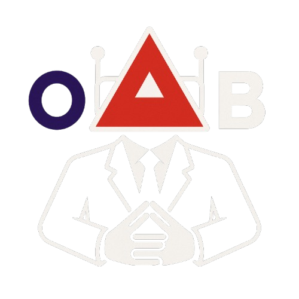

  </img>

# 👨‍⚖️ Oráculo OABot

**Oráculo OABot** é um assistente jurídico alimentado por Inteligência Artificial que combina modelos de linguagem de grande escala (LLMs) com técnicas de *Retrieval-Augmented Generation (RAG)*.

---

## 🧠 Tecnologias e Funcionalidades

- **LLM** para entendimento e geração de linguagem
- **LangChain** como orquestrador de fluxos inteligentes
- **RAG** para consulta de documentos PDFs
- **Telegram** para interação amigável ao usuário

---

## 👥 Tech Team

<table>
  <tbody>
    <tr>
      <td align="center" valign="top" width="14.28%"><a href="https://github.com/Bernardo-rar"> <b>Bernardo Ramos</b></a> 
      </td>
      <td align="center" valign="top" width="14.28%"><a href="https://github.com/DiasCaio"> <b>Caio Dias</b></a> 
      </td>
      <td align="center" valign="top" width="14.28%"><a href="https://github.com/moises-creator"> <b>Moisés Ximenes</b></a> 
      </td>
      <td align="center" valign="top" width="14.28%"><a href="https://github.com/RicardoMenezesBandeira"> <b>Ricardo Menezes</b></a> 
      </td>
    </tr>
  </tdbody>
</table>
